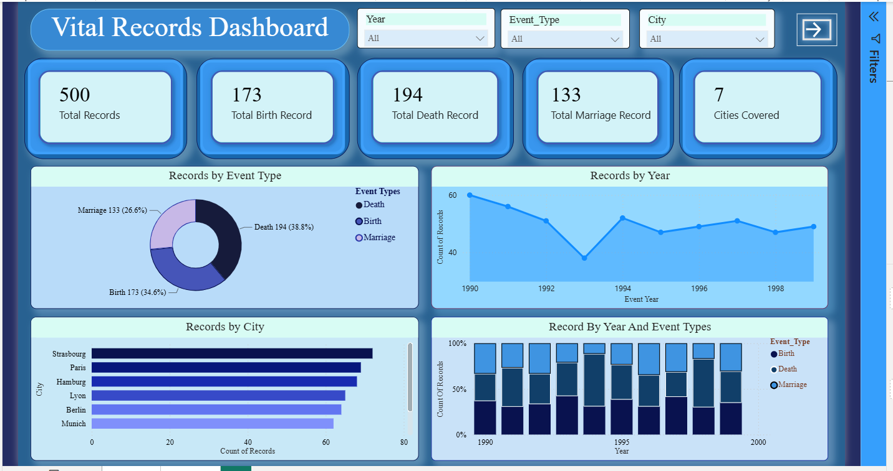
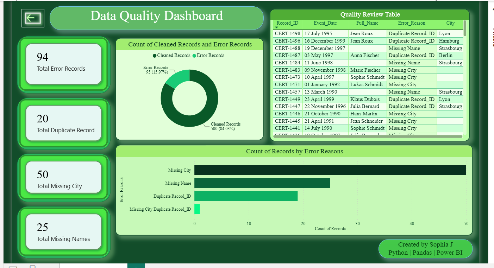

# Vital Records Data Quality Pipeline

> End-to-end data quality pipeline for multilingual vital records using Python, Pandas, NumPy, and Power BI.


---

## Overview

This project demonstrates a complete end-to-end data quality pipeline built using **Python, Pandas, NumPy, and Power BI**.

A multilingual civil records dataset containing **Birth, Death, and Marriage** certificates was synthetically generated with common real-world data quality issues such as missing values, duplicate records, inconsistent date formats, multilingual values, inconsistent name formatting, and extra spaces.

The dataset was then cleaned, validated, analyzed, and visualized using interactive Power BI dashboards.

---

## Project Objectives

- Generate a realistic multilingual dataset
- Simulate common real-world data quality issues
- Clean and standardize raw data using Python
- Detect and review data quality problems
- Build interactive Power BI dashboards
- Demonstrate a complete end-to-end data quality workflow

---

## Features

- End-to-end Data Quality Pipeline
- Synthetic multilingual dataset generation
- Missing value detection
- Duplicate record detection
- Date standardization
- Name formatting and text cleaning
- Data validation and quality review reporting
- Interactive Power BI dashboards

---

## Technologies Used

- Python
- Pandas
- NumPy
- Jupyter Notebook
- Power BI
- Git
- GitHub

---

## Project Structure

```text
vital-records-data-quality-pipeline/

│
├── dashboard/
│   └── project.pbix
│
├── data/
│   ├── raw_messy_certificates.csv
│   ├── cleaned_vital_records.csv
│   └── quality_review.csv
│
├── images/
│   ├── vital_records_dashboard.png
│   └── data_quality_dashboard.png
│
├── notebooks/
│   ├── Data_Generation.ipynb
│   └── Data_Cleaning.ipynb
│
├── README.md
├── LICENSE
└── .gitignore
```

---

## Data Quality Issues Simulated

The generated dataset contains several common real-world data quality issues:

- Missing Names
- Missing Cities
- Duplicate Records
- Duplicate Record IDs
- Mixed Name Capitalization
- Extra Spaces in Names
- Multiple Date Formats
- Multilingual Event Types
- French and German Month Names

---

## Data Cleaning Process

The data cleaning pipeline performs the following operations:

- Standardized multilingual event names into English
- Converted multiple date formats into a single standard format
- Normalized name capitalization
- Removed unnecessary spaces
- Identified duplicate records
- Detected missing values
- Generated a Quality Review report
- Exported a cleaned dataset for analysis

---

## Power BI Dashboards

### 1. Vital Records Dashboard

#### Key Insights

- Total Records
- Birth Records
- Death Records
- Marriage Records
- Cities Covered
- Records by Event Type
- Records by City
- Records by Year
- Records by Year and Event Type

#### Dashboard Preview



---

### 2. Data Quality Dashboard

#### Key Insights

- Total Error Records
- Missing Names
- Missing Cities
- Duplicate Records
- Error Distribution
- Clean vs Error Records
- Quality Review Table

#### Dashboard Preview



---

## Skills Demonstrated

- Data Cleaning
- Data Validation
- Data Quality Assessment
- Data Wrangling
- Exploratory Data Analysis (EDA)
- Pandas
- NumPy
- Power BI Dashboard Development
- Data Visualization
- Git & GitHub

---

## Future Improvements

- Automate the complete ETL pipeline
- Connect directly to SQL databases
- Add automated data validation rules
- Create a Data Quality Score
- Deploy dashboards to Power BI Service

---

## Author

**Sophia J**

**Data Quality Analyst**

Computer Science Graduate

### Technical Skills

- Python
- SQL
- Pandas
- NumPy
- Power BI
- Git & GitHub

### Connect with Me
**LinkedIn**

www.linkedin.com/in/sophia-j-b58310260

**GitHub**

https://github.com/sophiajayam

---

⭐ **If you found this project useful, consider giving it a Star!**
